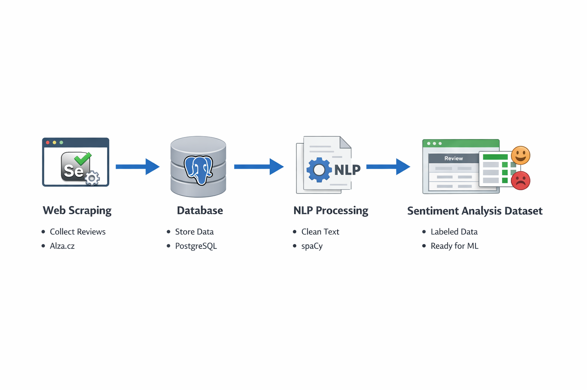

# Product Sentiment Analysis Pipeline

End-to-end data pipeline for scraping product reviews, storing them in a database, and preparing a dataset for sentiment analysis.

---

## Project Goal

The goal of this project is to demonstrate an **end-to-end data pipeline** including:

* web scraping
* database storage
* text preprocessing
* preparation of a sentiment analysis dataset

---

## Project Overview

This project demonstrates a complete **data pipeline workflow** built with Python.

The pipeline consists of:

1. **Web scraping** product reviews from an e-commerce website
2. **Storing scraped data** in a PostgreSQL database
3. **Text preprocessing** using Natural Language Processing techniques
4. Preparing a **clean dataset for sentiment analysis**

The project is implemented using **Python, Selenium, PostgreSQL, and spaCy**.

---

## Pipeline Architecture

<p align="center">
  <a href="images/pipeline_diagram.png">
    
  </a>
</p>

This diagram illustrates the **end-to-end workflow** of the project, from collecting product reviews to preparing a dataset ready for sentiment analysis.

Pipeline steps:

1. **Web Scraping (Selenium)** – product pages and reviews are collected
2. **Database Storage (PostgreSQL)** – scraped data is stored in structured tables
3. **Data Processing (spaCy)** – text preprocessing and cleaning
4. **Sentiment Dataset** – prepared dataset ready for NLP analysis

---

## Example Workflow

The following steps describe how data flows through the pipeline:

1. The scraping script visits product pages on **Alza.cz**
2. Product information and customer reviews are extracted
3. Data is stored in a **PostgreSQL database**
4. The processing pipeline loads the data into **Pandas**
5. Reviews are cleaned using the **spaCy NLP pipeline**
6. The final dataset is prepared for **sentiment analysis or machine learning**

---

## Example Dataset Output

Example rows stored in the dataset:

| product_name         | product_code | review                                    |
| -------------------- | ------------ | ----------------------------------------- |
| Apple Watch Series 9 | AW12345      | Great battery life and smooth performance |
| Apple Watch Series 9 | AW12345      | Display is very bright and clear          |
| Apple Watch Series 9 | AW12345      | Battery could last longer                 |

Each review is stored as a **separate row**, making the dataset suitable for **NLP tasks and machine learning models**.

---

## Technologies Used

* Python
* Selenium
* PostgreSQL
* psycopg2
* spaCy
* Pandas

---

## Project Structure

```
product-sentiment-analysis
│
├── README.md
├── requirements.txt
│
├── scraping_pipeline.ipynb
├── data_processing_pipeline.ipynb
│
└── images
    └── pipeline_diagram.png
```

---

## How to Run

### 1 Install dependencies

```
pip install -r requirements.txt
```

---

### 2 Configure PostgreSQL

Update database credentials inside:

```
scraping_pipeline.ipynb
```

---

### 3 Run scraping pipeline

Run the notebook:

```
scraping_pipeline.ipynb
```

This script:

* collects product pages
* scrapes customer reviews
* stores data in PostgreSQL

---

### 4 Run NLP processing pipeline

Run:

```
data_processing_pipeline.ipynb
```

This pipeline performs:

* text cleaning
* punctuation removal
* number removal
* lowercasing
* lemmatization

The result is a **clean dataset ready for sentiment analysis.**

---

## Future Improvements

Possible future extensions of the project:

* automated sentiment classification model
* pipeline automation using Apache Airflow
* API for retrieving processed reviews

---

## Notes

This project was created for **educational and demonstration purposes only**.

The scraped data was collected from publicly available pages on **Alza.cz**.

Always ensure that web scraping respects website terms of service.
